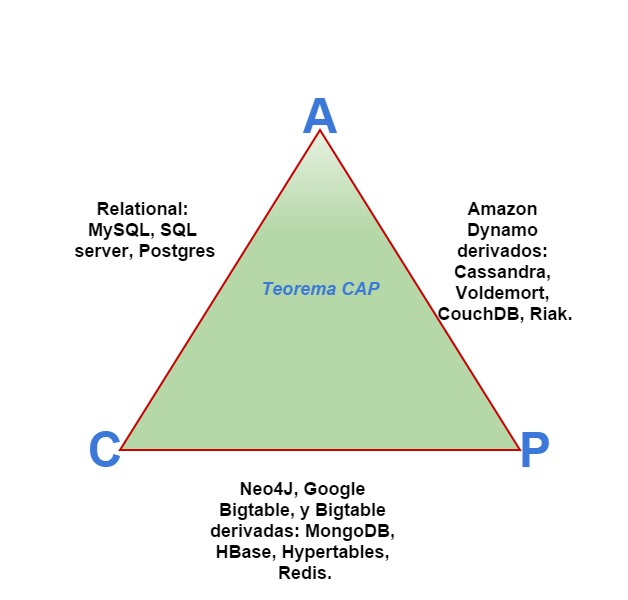
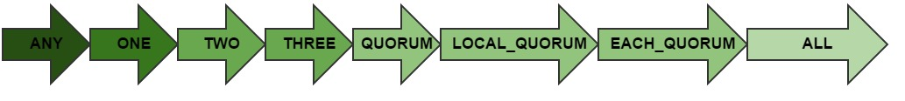
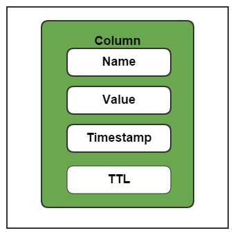
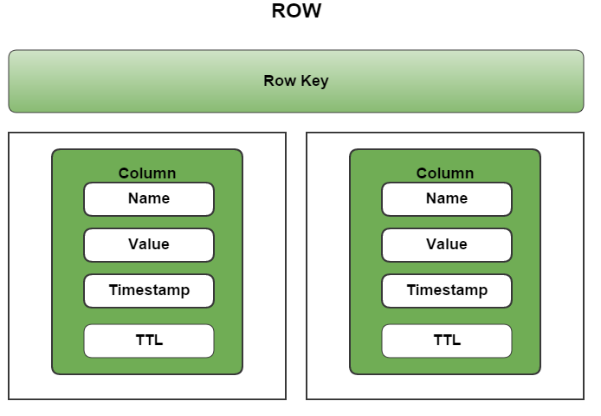
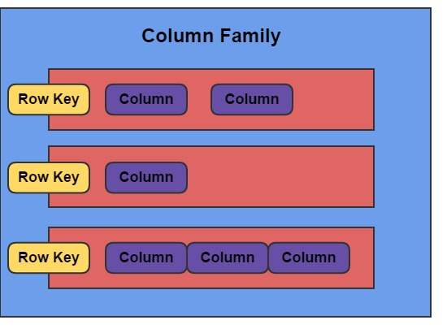
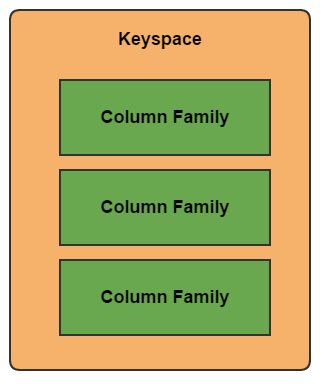
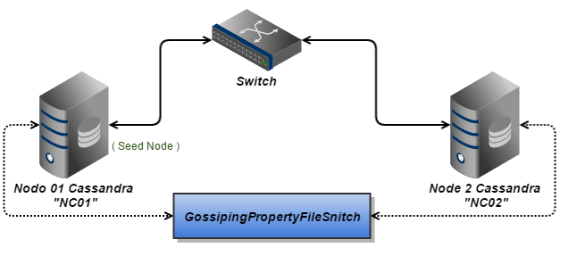

[TOC]

# Cassandra


**Web**: https://cassandra.apache.org/


## Introducción	

Los objetivos de este apartado es servir de base para introducirse por primera vez en el  desarrollo de aplicaciones que trabajen con sistemas distribuidos como lo  `Cassandra` y al mismo tiempo servir de guía de instalación, y puesta en marcha de esta poderosa herramienta de base de datos.

 Nos enfocaremos en mostrar las características esenciales de `Cassandra` como  base de datos posicionada en el teorema `CAP` como un sistema de almacenamiento altamente disponible y tolerante a `particionado` (`AP`).

Para los que nunca habían escuchado hablar de `Cassandra` será interesante conocer un poco de su historia. Esta base de datos fue dada a conocer por `Facebook` en julio del 2008.  `Cassandra` es un sistema de bases de datos altamente influenciado por `Dynamo`, el cual es otro sistema de base de datos distribuido, orientado a `key/value`, desarrollado como apuesta pionera de `Amazon` dentro del campo de los sistemas distribuidos. `Dynamo` influye a `Cassandra` con su modelo de `replicación sin un solo punto de fallo`  del inglés `“not  single point of failure (not SPOF)”`. 

Podemos definir `Apache Cassandra` como un sistema de código abierto, distribuido, descentralizado, escalable, de alta disponibilidad, tolerante a fallos, con consistencia ajustable, base de datos orientada a columnas que basa su diseño distribuido en `Dynamo` y su modelo de datos en la famosa `Bigtable` de `Google`.

`Cassandra` fue aceptada dentro de la incubadora `Apache` e  inmediatamente fue graduada como proyecto oficial para Marzo del 2010. Actualmente `Apache Cassandra` es una de las apuestas más fiables para sistemas de almacenamiento distribuido con alta `disponibilidad` y  tolerante a `particionado`, se considera uno de los sistemas más robustos en el mercado y la opción número uno donde se implementen sistemas `AP`.


## Características principales de Apache Casandra

En Resumen las características que hacen a `Apache Cassandra` una apuesta segura como de base de datos distribuida, son:

- Está escrito en Java y provee soporte nativo para este lenguaje.  
- Fue fuertemente influenciada por `Bigtable` de `Google` y `Dynamo` de `Amazon`.
- Es un Sistema de base de datos sin esquemas o mejor dicho de esquemas flexibles.
- Soporta datos sin estructura y estructurados.
- Es un Sistema descentralizado, distribuido y con arquitectura peer-to-peer.  
- Posee los modos de `replicación` de datos conocidos como   `Multi-data center y  rack-aware`.
- Es tolerante a fallos no `Not SPOF (no single point of failure).`
- Es un sistema elástico, masivo, y lineal-mente escalable.  
- Los nodos se pueden agregar o remover sin necesidad de detener el sistema.
- Es de alto rendimiento.
- Esta optimizado para escritura de datos.
- Consistencia ajustable, que provee la elección  del nivel de consistencia deseado pasando de consistencia eventual a niveles más fuertes de consistencia.
- Provee su propio `Cassandra Query Languaje (CQL)`, que imita la sintaxis de `SQL` para las instrucciones  `INSERT, UPDATE, DELETE, SELECT`.
- Es un sistema `Open Source` y posee una comunidad enorme, con el respaldo de compañías como `Facebook`.


## Sistema Distribuido y Descentralizado

El tema principal de estos apuntes es presentar a `Apache Cassandra` como un `sistema distribuido`. La idea de sistema distribuido se refiere a la capacidad des estos sistemas de ejecutarse en múltiples maquinas mientras desde el punto de vista del usuario se muestra como un sistema unificado, varias máquinas trabajando coordinadas como una sola.

 Muchos sistemas basan su arquitectura en el típico `Master/Slave`, en donde un nodo hace función de maestro y otros hacen función de esclavos, creando de esta forma lo que se conoce como un solo punto de fallo `(siglas en ingles SPOF)`. Estos sistemas se conocen como `sistemas centralizados`. 

`Cassandra` sin embargo, es considerado un sistema `descentralizado` dando la idea de que cada nodo es idéntico; en  `Cassandra` **no existen nodo maestro** que lleven información de coordinación.

Cuando nos referimos a `Cassandra` como un sistema descentralizado la principal idea que buscamos transmitir es  la capacidad del sistema de no poseer `SPOF`. Todos los nodos involucrados en un `clúster Cassandra` realizan  la misma función, esto se conoce por algunos como un `“Server Symetric”`, que representa la idea de que todos los nodos están haciendo exactamente la misma cosa. 

Sin duda, una de las claves principales de que  `Cassandra` se considere uno de los sistemas de base de datos distribuido de más alta disponibilidad  actualmente en el mercado, es su **arquitectura descentralizada**.

## Servicio Gossip y algoritmo para detección de fallos

Como todo sistema distribuido, cuando el número de nodos incrementa en el `clúster` surge la necesidad de intercambiar periódicamente los estados `(caída/muerte del nodo o la disponibilidad)` en que se encuentran los nodos que forman el sistema. 

Para esta necesidad de intercambio de estados `Cassandra` implementa el protocolo de comunicación llamado `Gossip`, que se encarga de diseminar el estado de los nodos por la red. En muchos medios se le suele llamar a `Gossip` como protocolo epidemia. 

> **Gossip**: es un protocolo de comunicación encontrado frecuentemente en arquitecturas peer-to-peer. Este protocolo provee un medio `(descentralizado, periódico,y automático)` de intercambio de la información de estado entre los nodos, sobre ellos mismos y sobre otros nodos que pertenezcan en la misma arquitectura.
>
> Todos los nodos que usen `Gossip` pueden saber rápidamente como se encuentran los otros nodos dentro del `cluster`. La información recogida por el protocolo `Gossip` también es almacenada local-mente por cada nodo  permitiendo un rápido medio de recuperación en caso de caídas del sistema.   

`Cassandra` usa un algoritmo de detección de fallos muy eficiente llamado `“Phi Accrual Failure Detection Algoritlm”`, encargado de detectar la falla de un nodo. Este `algoritmo` exhibe la peculiar característica de no representar el fallo de un nodo como un valor de dos estados, como son `Up` o `Down`. Este algoritmo maneja valores continuos entre los niveles `Down` y `Up`,  toma estos valores obtenidos periódicamente y provee un valor `probabilístico` para la toma de decisiones. Este tipo de algoritmo permite que un nodo local-mente usando la información de estados obtenida por `Gossip` y su historial, pueda determinar que nodo está en condiciones de trabajar correctamente en el `clúster`.

## Partición y `Replicación` de datos	

### Particionado:

`Cassandra` requiere que los datos sean `dinámicamente particionados` sobre un grupo de nodos en su `clúster`. Esta es una de las características principales de todo sistema de base de datos distribuido. Aquí entra en juego el término “`Keyspace`”, los `cluster` en `Cassandra` son contenedores de “`Keyspace`”. 

> Un “**Keyspace**” es análogo a lo conocido por esquema en una base de datos relacional. 

Cada `clúster Cassandra` tiene un sistema de gestión para mantener información sobre los “`Keyspace`”. Este sistema contiene las configuraciones encargadas de controlar la manera en que la información es distribuida y replicada dentro de un `clúster`. 

> Típicamente, un “**Keyspace**” es asignado a un solo `clúster`, pero un `clúster` puede contener más de un “`Keyspace`”. 

`Cassandra` se sirve de varias técnicas de `particionado` de la información contenida por estos “`Keyspace`”. Una de las técnicas para `particionado` más importantes de Cassandra es conocida como `“Consistent Haching”`, la cual busca mantener la relación entre los nodos del `clúster` y la información `particionada` implementando tablas con `hash` de claves entre los nodos. 

### Replicación:

Otro factor muy demandado por los sistemas distribuidos son soluciones para la `replicación` de los datos. Cassandra provee a sus clientes varias opciones `configurables` para la forma en que la data es replicada en sus `clúster`. Estas opciones `configurables` son llamadas “`Replication Strategy`”.

Las conocidas “`Replication Strategy`” proveen varias opciones de como replicar los datos, estas se conocen como:

- **Rack-Aware**:  

Esta estrategia es muy utilizada cuando se tienen nodos pertenecientes a un mismo `clúster Casandra`, pero distribuido entre varios data `centers`. Si se desea replicar información de estos nodos separados por data `centers` es necesario usar esta estrategia. Para implementar esta estrategia es necesario usar también los `Rack-Aware Snitch`. 

- **Rack-Unaware:**

 Esta estrategia también es conocida como “`Simple Strategy`”, es usada por defecto en `Cassandra`. Este estrategia se basa en un solo data `center`, los datos son transferidos de un `rack` a otro dentro del mismo data `center` pero no son replicados fuera de este. 

- **Network-Topology-Aware:**  

Esta estrategia permite configurar la manera en que las réplicas se realizaran entre los distintos data `centers`, posee las característica de las estrategias anteriores y agrega un archivo de configuración llama datacenter.properties, que se encarga de establecer opciones de `replicación` especificas por data `centers`. Al igual que `Rack-Aware` esta estrategia hace uso de los `Snitch`.

## Snitch	

Cuando se habla de estrategias de `replicación` en Cassandra entra en juego una de sus herramientas más interesantes, conocida como `Snitch`. Un **Snitch** en Casandra se encarga de verificar la proximidad entre los nodos en relación con otros nodos, es un factor primordial para las estrategias `replicación` entre nodos en distintos data `centers`. Posee características de `implementación` específicas para establecer estas medidas de proximidad, estas pueden ser configuradas por el administrador del `cluster`.

## Sistema  de Consistencia Ajustable	

Dentro del teorema **CAP** se considera a  **Cassandra** como un sistema a AP, un sistema con alta disponibilidad y tolerante a `particionado`. Esto no quiere decir que **Cassandra**  sea inconsistente en sus datos. Cuando nos referimos a la consistencia de un sistema hacemos hincapié  a la capacidad de este de proveer a todas las lecturas que se realicen, el valor más reciente escrito. 

Nuestra Cassandra es considerada por muchos  como un sistema **Eventualmente Consistente** en inglés `“Eventually Consistent”` lo cual no es totalmente cierto, en términos más reales se puede considerar como un sistema de **Consistencia Ajustable** `“Tuneable Consistent”`, la idea de un sistema de consistencia ajustable le permite fácilmente decidir el nivel de consistencia que requiera su aplicación, en balance con el nivel de disponibilidad. Se puede decir que la `consistencia y la disponibilidad son inversamente proporcionales` en un sistema `Apache Cassandra`.

La consistencia de un sistema distribuido en la práctica no es simplemente tema de blanco o negro, consistente o no consistente, en la realidad existen varias escalas de  grises que pueden servir o no para un modelo de negocio determinado. 

**Apache Cassandra** representa un sistema ajustable que da al `desarrollador` capacidad de maniobra y adaptabilidad.  Un modelo de almacenamiento para un tipo de negocio puede o no prescindir de la disponibilidad o viceversa prescindir de la consistencia, el punto focal para los sistemas de base de datos distribuidos es su capacidad de tolerar el `particionado`, es imposible gestionar un sistema coma **Facebook, Amazon o Ebay** sin poseer tolerancia al `particionado`.


## Factor de replicación y Nivel de consistencia	

El factor de `replicación` y el nivel de consistencia  son dos términos `ampliamente` utilizados en el mundo de Apache Cassandra. Esto causa cierto grado de confusión a la hora implementar  Cassandra. Es necesario resaltar sus diferencias.

- El **factor de replicación** está configurado por **Keyspace**, y es especificado en el archivo de configuración de los servidores. Sin embargo el **nivel de consistencia** es especificado por **query**, por el **cliente**. 

- El **factor de replicación** indica cuantos nodos quieres usar para almacenar un valor durante cada operación de escritura. El **nivel de consistencia** especifica cuantos nodos el cliente ha decidido necesarios para confirmar como consistente la información leída o escrita en un cluster Cassandra.  
- La confusión radica en que el **nivel de consistencia** está basado en el **factor de replicación**, no en el número de nodos en el sistema.

Un tema al tener en cuenta a la hora que nuestra aplicación crezca y se necesiten agregar más nodos al sistema, puedes necesitar incrementar el **Factor de Replicación**. Cuando el valor del Factor de Replicación es incrementado puede ser necesario reiniciar los nodos, para que de esta manera Cassandra redistribuya la información  en orden del nuevo valor del Factor de Replicación. 

Una herramienta que te permite trabajar con estos incrementos de manera rápida, es **NodeTool** que se encuentra en la carpeta **/bin** de Apache Cassandra.

## Clasificación según teorema CAP	

En el anterior apartado se presenta a `Cassandra` como un sistema de consistencia ajustable `“Tuneable Consistent”`, siendo en la práctica el término mejor acertado, no evita la duda de que en algunos sectores lo consideran como un sistema de  consistencia eventual `(“Eventually Cosistent”)`. 

Para entender el diseño de Cassandra y su título de sistema “Eventually Cosistent” es necesario comprender un famoso teorema para base de datos distribuidas denominado CAP, también conocido como teorema `Brewer` por su autor, `Eric Brewer`. 

El teorema CAP trata de establecer la relación entre 3 requerimientos de todo sistema de almacenamiento de datos distribuido. Estos tres requisitos están estrechamente relacionados uno del otro, estos se conocen como:

- **Consistencia (`Consistency`):**

> Todos los clientes de la base de datos deben poder leer los datos en su última actualización, sin haber discrepancia entre lo leído y lo escrito.

- **Disponibilidad (`Availability`):**

> Todos los clientes de la base de datos deben siempre poder leer y escribir.

- **Tolerancia a particionado (`Partition Tolerance`):**

> La base de datos puede ser dividida en múltiples maquinas; estas deben seguir en funcionamiento de cara a la segmentación de la red.

Del nombre en inglés de estos tres requerimientos surge el `acrónimo CAP,` usando `ampliamente` en el ámbito de sistemas distribuidos. Este teorema fue formalmente propuesto como verdadero por `Seth Gilbert y Nancy Lynch` del MIT en el año 2002. 

> El teorema CAP afirma que en todo sistema de base de datos distribuido, se puede tener solo dos de los requisitos previamente citado en este apartado. Esto quiere decir que si implementas un sistema distribuido que por principio debe ser tolerante a `particionado`, deberás elegir sacrificar entre consistencia y disponibilidad

El Teorema CAP indica que solo un sistema de base de datos puede realizar solo 2 de estas tres propiedades. A partir de este teorema se pueden clasificar cualquier sistema de base de datos en una de las tres categorías  siguientes:

- **Sistemas AP:**  

> Estos sistemas están enfocados principalmente en la `disponibilidad y la tolerancia a particionado`, esto quiere decir que este sistema puede retornar datos sin ningún tipo de consistencia, pero siempre estará disponible para lectura y escritura, de cara a `particionado` en la red que forma el `clúster`.

- **Sistemas CP:**

> Estos sistemas  están enfocados en `consistencia y tolerancia a particionado`, la idea de esto es que los datos leídos  de cara al usuario siempre serán los más actualizados, en caso de estos datos no cumplan esta condición el sistema, este sacrificara la `disponibilidad`. De esta manera aseguran que los datos sean en todo momento consistente de cara a los usuarios.
>  

- **Sistemas AC:**

> Estos sistemas están enfocados totalmente en proveer al cliente `consistencia y disponibilidad`, comúnmente estos sistemas usando `two-phase commit` para transacciones distribuidas. Estos sistemas no son tolerantes a `particionado`, quiere decir que se bloquean cuando ocurre una segmentación en la red. Esto reduce estos sistemas a `un solo data center clúster` para poder mitigar el `particionado` de la red.

Como podrán notar esta clasificación de sistemas no es totalmente excluyente, un sistema AC puede parecer que no tolere el `particionado` totalmente, y en cambio  puede funcionar de manera distribuida en un `clúster` con varias máquinas.

 La idea de un sistema sea `CP, AC y AP` se refiere a la capacidad que poseen para sacrificar una propiedad para garantizar las otras dos. Esto quiere decir por ejemplo, que en la práctica un sistema AP no puede ser totalmente inconsistente, se podría entender además que este sistema es capaz de tolerar inconsistencia en función de garantizar disponibilidad y `particionado`.

### Alguna clasificaciones según CAP:




### Niveles ajustables de consistencia en Cassandra



Los términos de la figura, son descritos de la siguiente manera:

- **ANY:** Es el menor nivel de consistencia. Provee el más alto nivel de disponibilidad.

- **ALL:** Es el más alto nivel de consistencia. Provee el nivel más bajo de disponibilidad.

- **ONE:** Este permite al menos una réplica.

- **TWO:** Permite al menos dos replicas.

- **THREE:** Este permite al menos tres replicas.

- **QUORUM:** Este asegura una fuerte consistencia, tolerando cierto nivel de fallos, el cual está determinado por (replication_factor/2)+1.

- **LOCAL_QUORUM**: Es usado para multi-data centers y rack-aware sin tráfico en inter-data center.

- **EACH_QUORUM:** Este es para multi-data centers y rack-aware.

  

 ## Modelo de Datos Apache Cassandra	

Cassandra es normalmente conocido como un sistema de base de datos con un modelo  de datos orientado a columnas “column-Oriented”, lo cual no es totalmente correcto. El modelo de datos de Cassandra `no es relacionar`, y sigue una estructura de  `hashtables multidimensionales` y `esparcidas`. 

Con el término “`esparcidas`” nos referimos a que dentro de una fila podemos tener una o más columnas, y que cada fila puede, no necesariamente, debe tener el mismo número de columnas, esto queda ilustrado en las siguientes imágenes que muestra filas con diferente número de columnas.

En este modelo cabe resaltar que cada fila (`row`) contiene un identificador único que hace accesible a los datos almacenados en esta. `Cassandra` te da la versatilidad de ir creando tu estructura de datos mientras desarrollas tu aplicación, esto quiere decir que puedes decidir agregar nuevos campos sin afectar las demás columnas de tu fila, es muy útil para desarrollo de aplicaciones `agiles`. Las siguientes figuras representan el modelo de datos de `cassandra` de manera didáctica.

La siguiente imagen muestra el elemento más pequeño del modelo de datos `Cassandra`, la columna, compuesta por `Name, Value, Timestamp y TTL (Time-To-Live)`.




La figura siguiente muestra la estructura de una fila la cual puede estar compuesta por varias columnas y posee un único `row key,` conocida comúnmente como `primary key`. 





 

La siguiente figura  muestra la estructura de una `Column Family` compuesta por muchas filas que a su vez pueden tener varias o una columna. Es lo análogo a una tabla en los modelos de datos relacionales.




 

La figura siguiente muestra la estructura de un `Keyspace`, formado por varias Column Family. 


 


Estas cuatro estructuras anteriores son las principales dentro del modelo de datos de Apache Cassandra y su conocimiento es esencial para poder desarrollar en este sistema. Existen otras estructuras de datos como son la `Super Column y Super Column Family`, que no son más que combinaciones de estas estructuras y su utilización puede ser necesaria para pocos casos en específico.

Dos características esenciales de comprender en el modelo de datos de Cassandra son:

- **Esquema de datos libre:**

> Cassandra está regida por cierto esquema en su modelo de datos, aunque para muchos se considera libre de esquemas, es necesario un contenedor exterior de datos, denominado keyspace, estos son los encargados de contener familias de columnas. Un keyspace es en esencia solo un espacio lógico de datos para mantener identificadas familias de columnas y ciertos parámetros de configuración. Las familias de columnas son nombres usados para organizar los datos.

- **Alto rendimiento:**

> Cassandra fue diseñado especialmente para tomar ventaja de las maquinas con multiprocesadores/multicore, y  correr atreves de cientos de estas máquinas  distribuidas en múltiples data-centers. Cassandra es uno de los sistemas de almacenamiento más poderosos de la actualidad siendo la base de cientos de proyectos y empresas que manejan cientos de `terabytes` de información.

## Instalación de Apache Cassandra

En este apartado nos enfocaremos en realizar un paso a paso de la instalación y puesta en marcha de un sistema Cassandra, mostrando como funciona y que puntos clave se deben tocar para realizar dicha instalación sin problemas. Recordamos que todos los nodos en un cluster Cassandra son configurados exactamente igual, partimos de este principio para realizar una arquitectura distribuida en Cassandra donde pondremos  2 nodos en funcionamiento formando un clúster.


## Especificaciones de la instalación

- **Sistema operativo Linux Debian:**

`Debian 8, 64 bit`

- **Versión Maven**

```bash
mvn -version
```

```
*Apache Maven 3.0.5*

*Maven home: /usr/share/maven*

*Java version: 1.8.0_31, vendor: Oracle Corporation*

*Java home: /usr/lib/jvm/java-8-oracle/jre*

*Default locale: en_US, platform encoding: UTF-8*

*OS name: "linux", version: "3.16.0-30-generic", arch: "amd64", family: "unix"*
```

- **Versión Java**

```bash
 java -version
```

```
*java version "1.8.0_31"*

*Java(TM) SE Runtime Environment (build 1.8.0_31-b13)*

*Java HotSpot(TM) 64-Bit Server VM (build 25.31-b07, mixed mode)*
```

```bash
javac -version
```

```
*javac 1.8.0_31*
```

- **Versiones Cassandra:**

`Apache Cassandra: 2.1.7`


## Instalación de un nodo Cassandra

1.  **Apache Cassandra** puede ser descargado de manera libre desde su web oficial http://cassandra.apache.org. Se debe elegir la versión estable, en el momento que escribo este texto la versión estable es 2.1.7.
    

2. Se debe descomprimir el paquete descargado, en el directorio que mejor le convenga para su instalación, en nuestro caso creamos un directorio **Cassandra** en nuestro directorio /Home. 

En **Cassandra** estas son las carpetas más importantes que se encuentra dentro del directorio `root /apache-cassandra-2.1.7`:

1. Directorio `/bin`:

> Este directorio contiene los ejecutable para correr a `Cassandra` y el `command-line insterface (CLI)` como cliente básico. Dentro de este directorio tenemos también varios `Scripts`, entre ellos esta `nodetool`, útiles para la administración y configuración del `Clúster`, y operaciones de mantenimiento. Otros `scripts` importantes son los `SSTables` útiles para convertir `datafiles` a `JSON` y viceversa.

2. Directorio `/conf`:

> Este directorio contiene los archivos de configuración de los nodos `Cassandra`, aquí se establecen varias configuraciones por defecto para inicial a trabajar con `Cassandra`. Estas configuraciones deben ser modificadas para permitir otros modos de operación que desee el desarrollado o administrador `Cassandra`.

3. Directorio `/inteface`:

> Este directorio solo contiene un archivo llamado `cassandra.thrift`. Este archivo representa el `Remote Procedure Call (RPC) client API` usado para hacer a **Cassandra** un sistema disponible para varios clientes y en distintos lenguajes de programación.

4. Directorio `/javadoc`: 

> Este directorio contiene un documentación completa del API cassandra en formato Web, usando como herramienta de desarrollo Java.

5. Directorio `/lib`:

> Este directorio contiene todas las librerías externas que Cassandra necesita para correr correctamente. Estas librerías incluyen las librerías `Thrift` y `Avro RPC` para interactuar con Cassandra.


 ### Nuestras primeras pruebas paso a paso:


1. Iniciar servidor Cassandra ejecutando el siguiente comando en terminal, posicionándote en el directorio apache-cassandra-2.1.7/bin. 

```bash
 ./cassandra –f
```

Debe concluir su ejecución en algo similar a la siguiente salida:

```bash
*INFO  17:51:35 Log replay complete, 43 replayed mutations* 
*INFO  17:51:35 Cassandra version: 2.1.7* 
*INFO  17:51:35 Thrift API version: 19.39.0* 
*INFO  17:51:35 CQL supported versions: 2.0.0,3.2.0 (default: 3.2.0)* 
*INFO  17:51:35 Initializing index summary manager with a memory pool size of 96 MB and a resize interval of 60 minutes* 
*INFO  17:51:35 Loading persisted ring state* 
*INFO  17:51:35 Starting up server* *gossip*
*...*
*INFO  17:51:36 Starting listening for* *CQL clients on localhost/127.0.0.1:9042**...*
*INFO  17:51:36 Binding* *thrift service to localhost/127.0.0.1:9160*
*INFO  17:51:36 Listening for thrift clients..*
```

2. Corriendo la interfaz `Command-Line` para clientes Cassandra.  (En la misma carpeta `/bin`)

```bash
 ./cassandra-cli
```

```bash
*Connected to**: "Test Cluster" on 127.0.0.1/9160*
*Welcome to Cassandra CLI version 2.1.7* 
*The CLI is deprecated and will be removed in Cassandra 2.2.*  *Consider migrating to cqlsh.*
*CQL is fully backwards compatible with Thrift data; see http://www.datastax.com/dev/blog/thrift-to-cql3* 
*Type 'help;' or '?' for help.* 
*Type 'quit;' or 'exit;' to quit.* 
*[default@unknown]* 
```

Como podrás notar en el mensaje que se muestra que esta interfaz para clientes está siendo sustituida por  **CQLSH**.

La siguiente salida resulta al ejecutar **cqlsh**, en esencia son prácticamente iguales. 

```bash
./cqlsh 
```

```bash
*Connected to* *Test Cluster at 127.0.0.1:9042**.*
*[cqlsh 5.0.1 | Cassandra 2.1.7 | CQL spec 3.2.0 | Native protocol v3]* 
*Use HELP for help.* 

cqlsh>
```

Cabe resaltar las diferencias que existen entre estas dos interfaces clientes del servidor Cassandra. En este punto, cuando ejecutamos cassandra-cli podemos observar que se conecta a “Test Cluster” nombre configurado por defecto en `conf/cassandra.yaml`:

```bash
*# The name of the cluster. This is mainly used to prevent machines in* 
*# one logical cluster from joining another.* 
*cluster_name: 'Test Cluster'*
```

La dirección de este Clúster es 127.0.0.1/9160 varia respecto `CQLSH`, si vamos a la salida del punto 1 cuando ejecutamos el servidor **Cassandra** podemos notar que esta dirección corresponde al servicio `Thrift`.

Cuando ejecutamos `apache-cassandra-2.1.7/bin$ cqlsh`, podemos notar que el nombre del `cluster` continua siendo el mismo `“Test Cluster”` previamente configurando en `cassandra.yaml`, la diferencia radica en el servidor al cual se conecta con la dirección  `127.0.0.1:9042`, usado para clientes CQL. Estos datos son útiles para la corrección de errores al no poder acceder a un servicio, para estos clientes se puede aislar la causa identificando el estado de estos dos servidores independientes.

3. Ejecutamos el comando **jps** para identificar los procesos java que se encuentran corriendo actualmente en nuestro nodo cassandra:

```bash
jps
```

```bash
*21508 CassandraDaemon* 
*25580 Jps*
*23615 CliMain* 
```

4. Implementaremos los `comandos` básicos de `cassandra-cli` o `cqlsh` de manera que le sea familiar al lector utilizar cualquiera de los dos clientes, resaltaremos el uso de la tecla <tab> para apoyar la memoria con el auto completado.

### Comandos básicos para cassandra  CLI:

Para presentar la ayuda de esta interfaz se ejecutar el `command “?”`.

Comandos muy útiles son los “`show`” presionando la tecla <tab> podemos ver todos los comandos disponibles, ejemplo comando “show” con tecla <tab>: 

```bash
default@unknown] show 
show api version    show cluster name   show keyspaces      show schema

```

Ejemplo del comando “show” para identificar el nombre del cluster, 

```bash
[default@unknown] show cluster name;
Test Cluster
```

### Comandos para crear un Keyspace en cassandra CLI:

```bash
[default@unknown] create keyspace AestApendiceCassandra;
8a017bcc-ac96-3c1b-99da-962db6125570
```

### Comandos para cambiar de keyspace en cassandra CLI: 

```bash
[default@unknown] use AestApendiceCassandra; 
Authenticated to keyspace: AestApendiceCassandra 
[default@AestApendiceCassandra]
```

Notar el cambio de `[default@unknown] a [default@AestApendiceCassandra].`

### Comandos para crear una familia de columnas en nuestro Keyspace llamado “`AestApendiceCassandra`”:

```bash
[default@AestApendiceCassandra] create column family Measurements; 
0444098a-d8e9-3311-8ab4-1a001eba7ac3

[default@AestApendiceCassandra] create column family User;
92185225-674d-30c9-93c4-c1fc9113f519

[default@AestApendiceCassandra] assume User keys as ascii;
Assumption for column family 'User' added successfully. 

[default@AestApendiceCassandra] assume User comparator as ascii; 
Assumption for column family 'User' added successfully.

[default@AestApendiceCassandra] assume User validator as ascii; 
Assumption for column family 'User' added successfully.

[default@AestApendiceCassandra] assume User sub_comparator as ascii;
Assumption for column family 'User' added successfully.

[default@AestApendiceCassandra] describe AestApendiceCassandra; 
*...*
*Keyspace: AestApendiceCassandra:* 
*Replication Strategy: org.apache.cassandra.locator.NetworkTopologyStrategy* 
*Durable Writes: true* 
*Options: [datacenter1:1]* 
*Column Families:* 
*ColumnFamily: meassurements* 
   *...*
*ColumnFamily: user* 
```

```
assume <column_family> keys as <type>;

Assume one of the attributes (comparator, sub_comparator, validator or keys)
of the given column family to match specified type. Available types: bytes, integer, long, lexicaluuid, timeuuid, utf8, ascii.
```

### Comandos para lectura y escritura en cassandra-cli:

```bash

[default@AestApendiceCassandra] set User['AEST']['usrname']='Cassandra' ;

Value inserted. 
Elapsed time: 0.9 msec(s).

[default@AestApendiceCassandra] set User['AEST'['usremail']='cassand@gmail.com';

Value inserted.
Elapsed time: 0.75 msec(s). 


```


### Conteo de celdas en User:

```bash
[default@AestApendiceCassandra] count User['AEST']; 

2 cells
```


### Mostrar los datos almacenados en AEST:

```bash
[default@AestApendiceCassandra] get User['AEST'];

=> (name=usremail, value=cassand@gmail.com, timestamp=1444510265698000)
=> (name=usrname, value=Cassandra, timestamp=1444510062579000)
Returned 2 results.
Elapsed time: 75 msec(s).


```


 ### Para borrar un kespace se utilaza el comando:

```
[default@AestApendiceCassandra] drop keyspace  AestApendiceCassandra;
```

Ten mucho cuidado con usar `drop` en cualquier base de datos que no sea un ambiente de pruebas controlado.


### Para borrar una column family se usa el comando:

```bash
[default@AestApendiceCassandra] drop column family User;
```


**Para borrar una fila se usa:**

`*[default@AestApendiceCassandra] del User['AEST'];*`

**Para borrar una columna se usa:**

`*[default@AestApendiceCassandra] del User['AEST']['usrname'];*`


 

5. Implementaremos los comandos básicos de CQLSH de manera que le sea familiar al lector utilizar cualquiera de los dos clientes mencionados en el paso 2, resaltaremos el uso de la tecla <tab> para apoyar la memoria.

**Comandos Show:**

`cqlsh> SHOW`  

> *HOST     SESSION  VERSION*   

`cqlsh> SHOW host` 

> *Connected to Test Cluster at 127.0.0.1:9042.* 

**Comandos para crear un Keyspace Nuevo:**

`cqlsh> create keyspace AestApendiceCassandra` 

>    *... WITH REPLICATION=*  *... {'class':'SimpleStrategy', 'replication_factor':1};* 

**Cambiar de Keyspace:**

```bash
cqlsh> use AestApendiceCassandra; 
cqlsh:aestapendicecassandra>
```

**Crear tablas:**

```cql
cqlsh:aestapendicecassandra> CREATE TABLE User( 
 	usrname ascii,
	usremail ascii,
	IMSDN bigint,
	timestampfield timestamp, 
	uuidfield uuid, 
 	PRIMARY KEY(uuidfield) 
); 
```

**Insertar datos:**

```CQL
cqlsh:aestapendicecassandra> INSERT INTO User(
usrname, 
usremail,
IMSDN,
timestampfield, 
uuidfield 
) VALUES( 'Cassandra', 'cassandra@gmail.com', 1245678925635,'2015-05-03 01:06:08',uuid()
);
```

**Selección de datos:**

`cqlsh:aestapendicecassandra> select \* from User ;` 

**Estructura especiales Type:**

```cql


cqlsh:aestapendicecassandra> CREATE TYPE measurement(
    level ascii,
    signal bigint,
    quality text,
 );

cqlsh:aestapendicecassandra> CREATE TABLE device (
    rowkey ascii PRIMARY KEY,
    measurementfield frozen<measurement>, 
    tuplefield frozen<tuple<int,text>>
 ); 

cqlsh:aestapendicecassandra> INSERT INTO device(
		rowkey, measurementfield, tuplefield) 
		values( 'key', {level:'Alto', signal: 10045670, quality:'donw'},(125,'rty'));

cqlsh:aestapendicecassandra> select measurementfield, measurementfield.level, tuplefield from device;


```


## Instalación de 2 nodos Cassandra Distribuidos

La figura  muestra la `topología` de red implementada en nuestra prueba de concepto de Apache Cassandra Distribuida.  El nodo `NC01 y NC02` pertenecen al mismo `Cluster cassandra` configurado en el archivo `cassandra.yaml`, el nombre de este cluster es `“Test Cluster”`. Estos nodos pertenecen al mismo rack llamado `“RACKTest”` y al mismo data center llamado `“DCTest”`.



En Casandra existen 3 archivos que son de vital importancia para configurar los aspectos del sistema, estos archivos son:

- El archivo `conf/cassandra-rackdc.properties:`

> La configuración de este archivo está ligada a la propiedad “**GossipingPropertyFilesSnitch**”, y su función es permitir un medio de sincronización entre los nodos Cassandra, que forman nuestra topología. Por ejemplo, la configuración usada para nuestra topología  es: 

```bash
dc=DCTest
rack=RACKTest 
```

- El archivo `conf/cassandra-topology.properties`:

> La configuración de este archivo está ligada a la propiedad “**PropertyFileSnitch**”, y su función es permitir al administrador establecer la topología de la red donde despliega el sistema Cassandra, establecer los racks y data centers que pertenece cada nodo con su respectiva IP. Se puede seguir el ejemplo que trae por defecto Cassandra, modificar las IP y comentar lo que no sea necesario. 

- El archivo `conf/cassandra.yaml`:  

> Este es el archivo principal de configuración usando por Cassandra, este archivo se establece el nombre del clúster y las propiedades que este implementara. Para nuestra configuración debemos realizar la siguiente modificación en los dos nodos.

```bash
Seeds :  NC01
Listen_address:
Rpc_address: 0.0.0.0
Endpoint_snitch: GossipingPropertyFileSnitch
```


- 

## NodeTool

NodeTool es una de las herramientas más utilizadas para gestionar y monitorizar Cassandra. Se interactúa con  ella atreves de una interface Command-Line que va de la mano con la instalación de un nodo Cassandra. Algunas de las opciones más usadas de esta interfaz son:

- **Status:**  

>  Provee un resumen del cluster al cual pertenece el nodo, su carga y los IDs.

- **Netstats:**

> Este muestra información de red del nodo, enfocándose en las operaciones de lectura y escritura.

- **Info:**  

> Este muetra mucha información sobre el nodo incluyendo token, carga sobre el disco, uptime, java heap memory usada, key cache, y row cache.

- **Tpstats:**  

> Este muestra estadísticas sobre el número de tareas que están pendientes, activas y completadas.
>  

- **Cfstats:**

> Este muestra estadísticas de una o más tablas, como son la cuenta  operaciones de lectura y  escritura, métricas sobre las SSTables, memtable, Bloom filter, entre otras.

## Bibliografía	


Hayashibara, N. (2004). *The phi Accrual Failure Detector.* Japan: Advanced Institute of Science and Technology.

Hewitt, E. (2010). *Cassandra-Definitive Guide.* Sebastopol: O'Reailly Media, Inc.

Kan, C. (2014). *Cassandra Data Modeling and Analysis.* Birmingham: Packt Publishing Ltd.

LaksHman, A. (2013). *Cassandra- A Desentralized Structured Storage System.* USA: Facebook.

Strickland, R. (2014). *Cassandra High Availability.* Birmingham: Packt Publishing Ltd.

